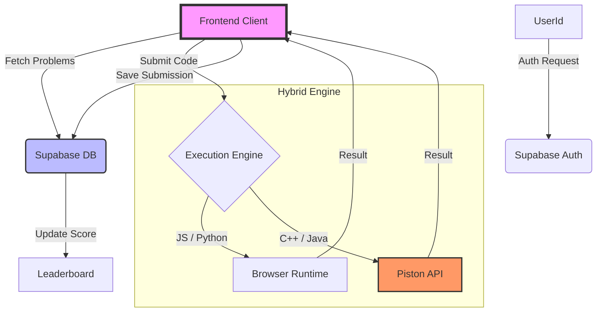
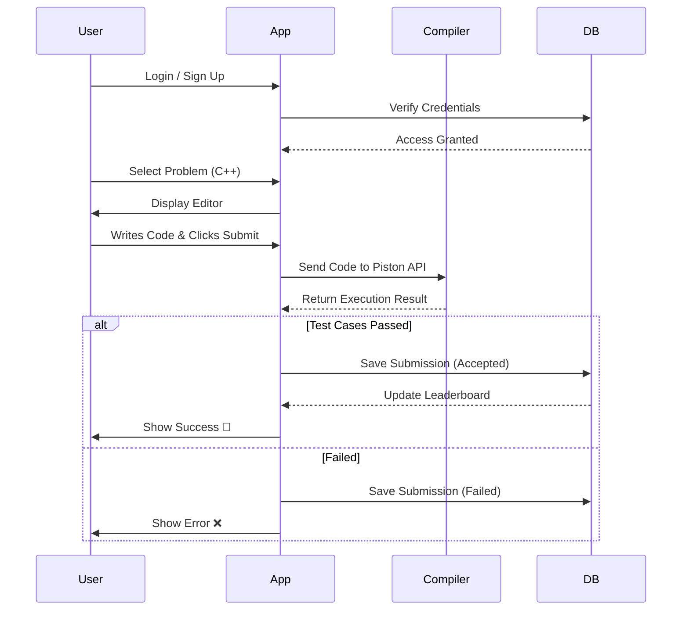

# Logic Ladder Pro 🚀
### The Ultimate Coding & Learning Platform

---

## 🌟 Introduction

**Logic Ladder Pro** is a next-generation coding assessment platform designed to revolutionize how students learn and practice programming. 

Unlike traditional platforms, it offers a seamless, **Docker-free** execution environment perfect for college labs and personal devices.

#### 🎯 Mission
To provide a fast, secure, and accessible coding environment for everyone, everywhere.

---

## 💡 Key Features

*   **⚡ Hybrid Execution Engine**: 
    *   **JavaScript/Python**: Runs instantly in the browser (Zero Latency).
    *   **C++/Java**: secure execution via Piston API.
*   **🏆 Real-time Leaderboard**: Gamified experience to track progress and rank against peers.
*   **🛡️ Secure & Scalable**: Built on **Supabase** (PostgreSQL) with Row Level Security.
*   **🎨 Modern UI/UX**: Beautiful, neon-themed interface for an immersive coding experience.
*   **👨‍💻 Admin Dashboard**: Full control to manage problems, users, and submissions.

---

## 🏗️ System Architecture

---

## 🔄 User Flow Diagram

---

## 🛠️ Technology Stack

| Component | Technology | Logo/Icon |
| :--- | :--- | :--- |
| **Frontend** | React + Vite + TypeScript | ⚛️ |
| **Styling** | Tailwind CSS + Shadcn UI | 🎨 |
| **Backend** | Supabase (PostgreSQL) | 🐘 |
| **Compiler** | Piston API + Pyodide | ⚙️ |
| **Icons** | Lucide React | 🖼️ |

---

## 🚀 Why "Docker-Free"?

Many college labs restrict installing Docker or virtual machines. 

**Logic Ladder Pro** solves this by:
1.  **Using APIs** (Piston) for heavy languages.
2.  **Using WebAssembly** (Pyodide) for Python.
3.  **Using Browser Native** for JavaScript.

**Result:** Zero setup required. Runs on any browser.

---

## 🔮 Future Scope

*   **🤖 AI Hints**: Integrated AI assistant to help students when stuck.
*   **📱 Mobile App**: Learn and code on the go.
*   **⚔️ 1v1 Battles**: Live coding competitions between students.
*   **🎓 Classroom Mode**: Teachers can assign homework and track class progress.

---

## 🏁 Conclusion

**Logic Ladder Pro** is not just a tool; it's a complete ecosystem for nurturing the next generation of developers. 

**Thank You!** 
👋

---
*Created with ❤️ by the Logic Ladder Team*
